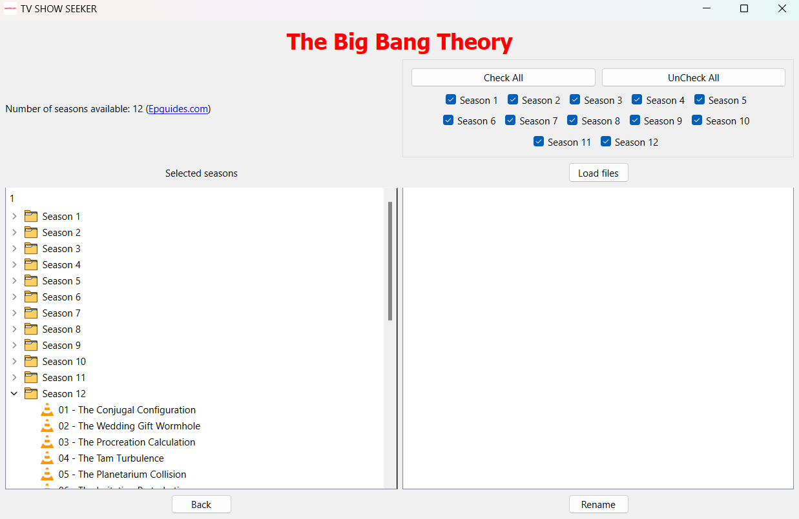

# AutoShowRenamer (TVShowTagger)

A PyQT6-based application designed to automate the renaming of TV show episodes by fetching episode details from online databases.

## Overview

AutoShowRenamer, also known as TVShowTagger, simplifies the process of organizing and renaming TV show episodes. The application streamlines episode management by fetching metadata from **epguides.com** and allows users to effortlessly match and rename their local episode files.

## Features

- **Dynamic Show List**: Retrieve an updated list of TV shows from **epguides.com**. Built once for speed, but can be refreshed anytime.
  
- **Detailed Show Information**: Before renaming, verify the show's details. Information is fetched from **epguides.com** and **IMDb** and stored locally for faster future access.

- **Intuitive Local Episode Management**: Choose a directory containing your TV show episodes and let the app display them in an organized fashion.

- **Selective Episode Renaming**: The application provides flexibility in renaming, letting users choose specific episodes or seasons.

- **Database Integration**: Uses SQLite to store show details locally, eliminating the need for repeated online queries for the same show.

- **Interactive UI**: Built with PyQT6, providing a user-friendly experience from selection to renaming.

## Directory Structure

- **images**: Contains icons and graphics used within the application.
  
- **interface**: Houses the user interface elements and related logic.
  
- **utilities**: Backend support, including database handling and web queries.

## Usage

1. Build or refresh the TV show list.
2. (Optional) Verify the selected show's details.
3. Choose a local folder containing the show's episodes.
4. Match the episodes for renaming.
5. Review and confirm renaming.

## Contribution

If you'd like to contribute, please fork the repository and make changes as you'd like. Pull requests are warmly welcome.

## License

[MIT](https://choosealicense.com/licenses/mit/)
